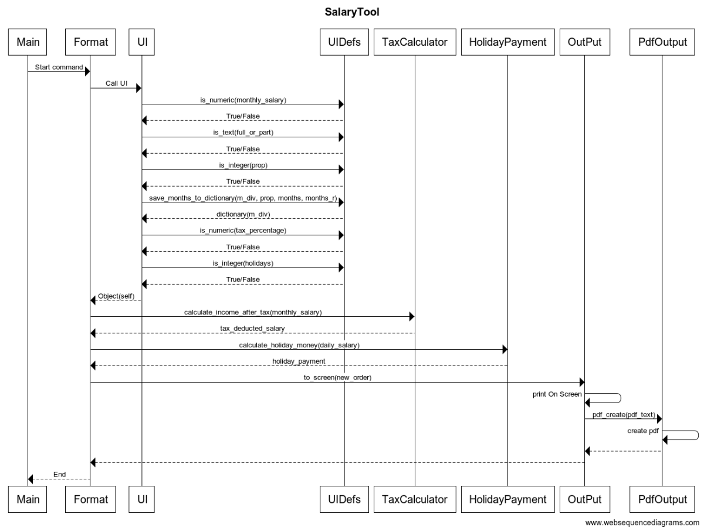

# Luokkakaavio

# Sekvenssikaavio

Kun ohjelma käynnistetään mainissä ohjelman kontrolli siirtyy Format luokan kautta UI:hin. UI:ssä käyttäjää pyydetään syöttämään 
	- kk palkka
	- onko työaika laatua kokoaika vai osa aika
	- kuukaudet joilta palkkaa tulee (joko osaikaisesti tai kokoaikaisesti)
	- veroprosentti
	- lomapäivät 
	
Jokaisen syötteen kohdalla UI kutsuu UIDefsiä jossa tarkastetaan syötteen oikeellisuus. 
Kun kaikki tarvittava on syötetty palauttaa UI datan Format luokalle. 
Format luokka formatoi datan muotoon josta se voidaan helpommin tulostaa ruudulle ja/tai tiedostoon,
Format luokka myös kutsuu seuraavia luokkia joissa tehdään erinäisiä laskutoimituksia

	- PartTimeCalculator 
	- TaxCalculator
	- HolidayPayment
	- MonthlyToDaily
	- YearlyHolidaysToMonthly
	 
Laskutuoimituksien jälkeen luokka Output tulostaa formatoidun datan ruudulle ja kutsuu PdfOutput luokkaa 
tallentaen saman datan pdf tiedostona.

