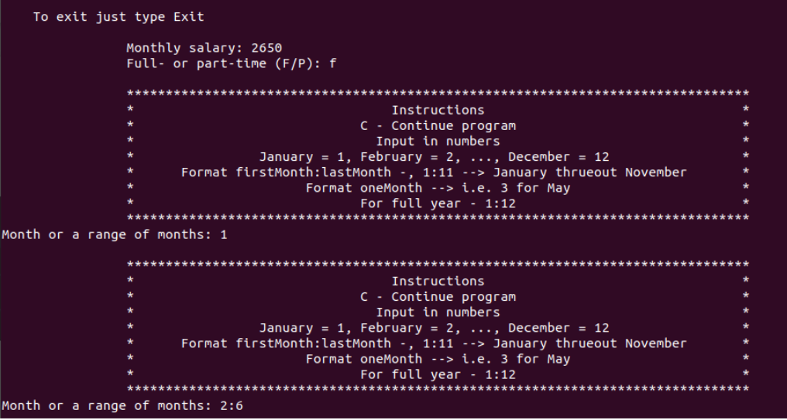
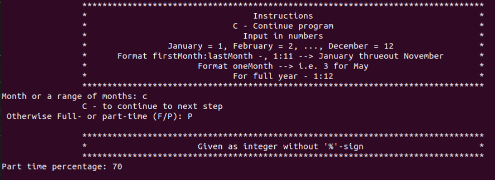
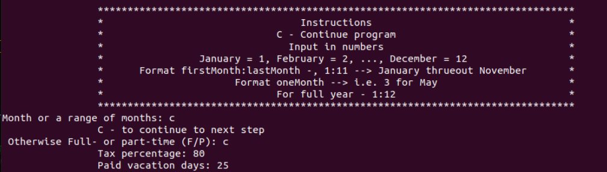
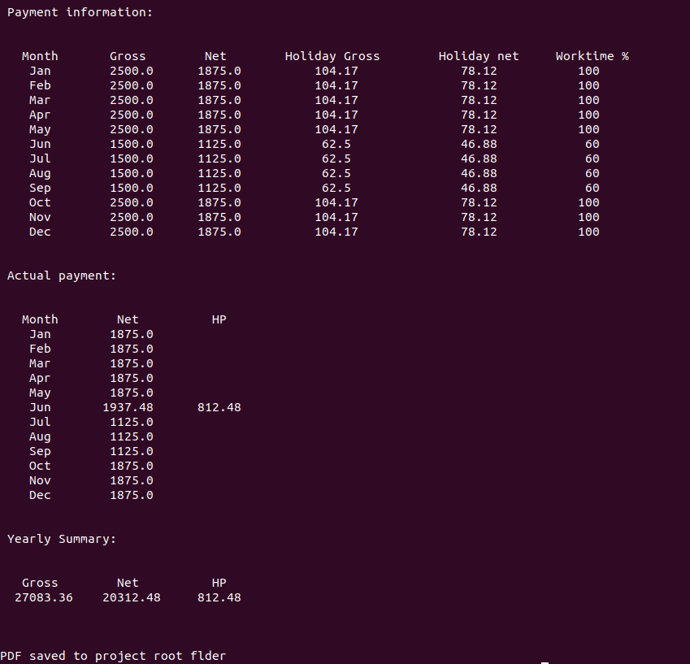

# Käyttöohje

*Release version käyttöohje*

##  Ohejalman käynnistäminen

# Riippuvuudet 

`poetry install`

# Ohjelman käynnistys

`poetry run invoke start`

## Taustaa

Ohjelman idea syntyi omista tarpeista. Opiskelun aloittaessani muutin työsuhteeni 
osa-aikaiseksi tietyiltä kuukausilta. Teen siis lyhennettyä työpäivää osan vuodesta ja osan
vuodesta kokonaista työpäivää. Vuositulojen ja lähinnä tulevien lomarahojen hahmottelu ei ollutkaan 
aivan yhtä suoraselkoista kuin aikasemmin. 

Ohjelman avulla pystyy helposti laskemaan vuoden, tai lyhyemmän ajan, brutto ja netto  ansiot lomarahoineen.

## Yleiset ohjeet

Osa-aikaisuudella tarkoitetaan tässä yhteydessä prosentuaalista osaa kokopäiväisestä työajasta.
Esimerkiksi 80% osa-aikaisuus tarkoittaa työajan pituuden olevan 80% kokopäiväisestä työajasta,
näin ollen ohjelma laskee 80% kuukausipalkasta niille kuukausille joille osa-aikaisuus on merkitty.

Lomarahojen laskutapa vaihtelee työehtosopimuksista riippuen, mutta tällä hetkellä ohjelma laskee 
lomarahat päiväpalkka / 2. Laskutapa on käytössä Tietotekniikan- sekä Finanssialan TES:ssä.   

Lomarahat maksetaan oikeasti vasta seuraavana vuonna niiden ansaitsemisen jälkeen. 
Ohjelma kuitenkin laskee annetuille lomapäiville lomarahan. 
Jos muutosta työajassa viime vuoteen verrattuna ei ole ollut toteutuu laskelma oikein,
muuten on hyvä ottaa huomioon että lomarahojen summa on tulevana vuotena maksussa.    

Päiväpalkkaa lasettaessa, jota käytetään lomarahojen laskemiseen, käytetään jakajana `config.cfg` tiedostossa olevaa MonthlySalaryToDaily -muuttujan arvoa. 
Tämäkin luku vaihtelee TES:stä riippuen, `config.cfg` tiedosto sijaitsee hakemistossa `src/config/`.    

## Yleiset huomiot

Tekstipohjainen käyttöliittymä ei ole kaikista innovatiivisin ja sen käyttö voi tuntua aluksi hankalalta. 
Tarkastuksia on paljon ja syöttö formaatti tulee olla oikeanlainen jotta ohjelmassa saa kaikein syötettyä. 
Voi myös tuntua että kohdassa jossa valitaan ensin koko- tai osa-aika ja sen jälkeen kuukaudet loopataan turhaan. 
Tämän kohdan edes takaisin palloittelu mahdollistaa tarpeen vaatiessa sen että jokaiselle kuukaudellevoi syöttää oman prosentuaalisen ajan. 

Kuten yllä on jo mainittu niin lomarahat maksetaan oikeasti vasta seuraavana vuonna lomapäivien ansaitsemisesta.
Ohjelmassa lomarahat lasketaan maksettavaksi kokonaisuudessaan kesäkuussa, oli silloin ollut töissä tai ei.
Ohjelma olettaa että käyttäjä tietää palkkansa lisäksi lomapäviensä määrän sekä veroprosenttinsa. 

Päiväpalkka lasketaan kuukausipalkasta 22 päivän säännöllä. Jos tätä haluaa muuttaa voi sen tehdä `config.cfg` tiedoston kautta. 

## Käyttö

Ohjelman käynnistyksen jälkeen pääsee käyttäjä poistumaan siitä missä tahansa vaiheessa kirjoittamalla 
ruudulle `exit`

1 Ohjelma pyytää syöttämään kuukausipalkan `Monthly salary:` johon annetaan palkka jolla laskelma halutaan tehdä.
2 Ohjelma kysyy onko kyseessä kokoaika vai osa-aika `Full- or part-time (F/P):` tähän vastataan joko `f`(ull) tai `p`(art) kirjaimella
3 Jos kyseessä on kokoaika (`f` syöttö) annetaan seuraaavaksi kuukaudet jolle laskelma halutaan tehdä, `Month or range of months:`.
Syötteen voi joko antaa kuukausi kerrallaan jolloin numero `1` vastaisi tammikuuta, tai joukkona `1:4` joka vastaisi aikaväliä tammi - huhikuuta.
Syötettä antaessa ei kuukausien järjestyksellä ole merkitystä. 

4 Kun joko yksi kuukausi tai kuukausi joukko on syötetty pytää ohjelma syöttämään uuden kuukauden tai joukon joka lisätään laskelmaan. 
Antamalla syötteenä `c` palaa ohjelma kohtaan 2.
Jos kaikki halutut kuukaudet annettu jatketaan ohjelman kulkua syötteellä `c`.

5 Jos syötteeksi annetaan `p` pyytää ohjelma syöttämään osa-aikaisuuden `Part time percentage:`. Tämä annetaan kokonaislukuna, esim. `70`
jonka jälkeen annetaan kuukaudet joille laskelma halutaan tehdä. 

6 Kun ylläolevat syötteet on saatu annetua pyydetään veroprosenttia `Tax percentage:` tämäkin annetaan kokonaislukuna, esim. `25`. 
Oman veroprosenttinsa voi laskea osoitteessa [laskuri](https://avoinomavero.vero.fi/_/)

7 Viimeiseksi pyydetään palkallisten lomapäivien määrää `Paid vacation days:` näiden avulla lasketaan lomarahat

8 Tämän jälkeen ruudulle tulostuu erittely tuloista kuukausitasolla sekä polku jonne data on tallennettu pdf muodossa.
Otsikkorivillä oleva HP on lyhennys HolidayPayment, eli lomarahoista. 

