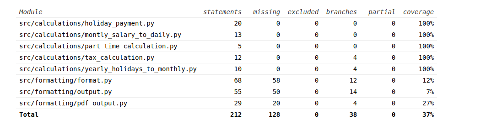

# Testaus

## Manuaalisen testauksen osuus

Ohjelman testausta on suoritettu sekä automatisoidusti että manuaalisesti. `UI`:n syöttö testauksesta huolehtii `UIDefs`-luokka. 
Jokainen `UI`-luokan syötön oikeellisuus tarkistetaan `UIDefs`-luokassa, muulla tavoin ei `UI`-luokkaa testata erikseen.

Ohjelmoitsian näkökulma ei aina välttämättä kohtaa käyttäjän näkökulmaa ja näin olleen joissain virheilmoituksissa voisi aivan varmasti olla parantamisen varaa.
Mutta yleisesti ottaen virheilmoituksista on yritetty saada mahdollisimman ymmärrettäviä ja kattavia.

## Automattitestauksen kattavuus

Testikattavuus on jäänyt hämmentävän pieneksi, tämä johtunee osittain `Format` -luokan sisältämästä yhdesta (ja ainoasta) isosta funktiosta.
Voimme vain olettaa että testivastaavan kapasiteetti ei riittänyt tekemään testejä näin isolle ja kattavalle funktiolle. 
Olisi tietysti ollut mahdollista jakaa `Format`-luokka pienempiin funktioihin mikä olisi osaltaan helpottanut testien kirjoittamista mutta jo toimivan koodin 
uudeelleen kirjoittaminen sisältää aina omat riskinsä. Myös rajallinen aika ja muut tehtävät ovat vaikuttaneet siihen mihin projektissa on panostettu.

## Asennus 

Asennus testaus on tehty sekä cloonaamalla gitti ja downloadaamalla release. Asennus on suoraviivainen eikä seuraamalla asennusohjeita `README.MD`:ssä
tuottanut minkäänlaisia virheilmoituksia tai muita ongelmia. Tosin ohjelmaa ja asennusta on vain testattu `linux` ympäristössä. Tietoa siitä vaatisiko joko 
`Windows` tai `Mac` ympäristö jotain lisää ei ole tietoa.      

## Toiminnallisuus

Toiminnallisuus on todettu samaksi kuin mitä [`vaatimuusmäärittely.md`](https://github.com/gitcomits/ot-harjoitustyo/blob/master/SalaryTool/dokumentaatio/vaatimusmaarittely.md)
 sisältää. On todettava että ohjelman aikaiset ohjeistukset eivät välttämättä joka kohdassa ole mahdollisimman selkeitä. On kuitenkin yritetty ilmaista mitä ja 
missä muodossa syöte halutaisiin. Käytössä ei kuitenkaa pitäisi ilmetä hämmennystä jos käyttäjä turvautuu 
käyttöohjeisiin [`käyttöohje.md`]((https://github.com/gitcomits/ot-harjoitustyo/blob/master/SalaryTool/dokumentaatio/kayttoohje.md).

## Laatuongelmat

Tässä tapauksessa laatuongelmiin voisi laskea graafisen käyttöliittymän puuttumisen. Tekstipohjainen käyttöliittymä on ilmeisesti ollut helpompi toteuttaa 
ja siksi siihen on päädytty. Ellei tätä suoraan laatuongelmaksi lasketa niin ainakin käyttökokemusta heikentävänä elementtinä se tulisi huomioida. 

